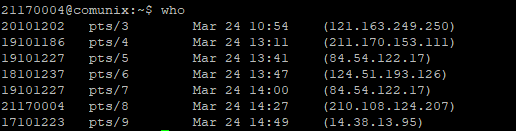
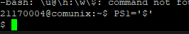

# Zusammenfassung Unix System

## Chapter 1
<hr/>

```bash
uname -a
```
Operating System information  
Output: 
`SunOS communix 5.11 11.3 i386 i86pc`
<hr/>


```bash
date
```
Shows the current date  
Output: 
`Wednesday, March 24, 2021 02:30:47 PM KST`
<hr/>

```bash
id
```
Shows User ID and Group ID
Output: 
`uid=1563(21170004) gid=500(studs)`
<hr/>

```bash
who
```
Shows who is connected on which terminal
Output: 

<hr/>

```bash
uname -a
```
Output: 
`SunOS communix 5.11 11.3 i386 i86pc`
<hr/>

```bash
uname -a
```
Output: 
`SunOS communix 5.11 11.3 i386 i86pc`


## Chapter 4

```bash
ls -l
ls -ld
```
Output: 
1. data blocks - Wenn auf Directory angwendet das leer ist, kein output
2. i-node

<hr/>

```bash
od -x hi.txt
```
Output:  


File Contents in hexadecimal  
-c: in asci
<hr/>  

```bash
find /export/home -name 'hi.txt'
2> /dev/null
```
1. Finds all hi.txt files in directory
2. ```2> /dev/null ```omits error output o for access denied

```bash
find / -name core -exec rm {} \;
```

Removes files (- exec ls lists all found, etc)

-ok statt -exec: Fragt, ob das file genommen werden soll

<hr/>

```bash
chmod 644 hi.txt
chmod u+x,g=rw-,o-r hi.txt
```
644: u=rw, g=r--,o=r--
755: u=rwx,g=r-x,o=r-x  

+fügt berechtigung hinzu
-nimmt Berechtigung weg

<hr/>

```bash
umask 022
```

Defines masking for permissions

<hr/>

```bash
df -k
```
Shows disk free size (partition)

```bash
du -sk *
```
Shows disk usage size (directory)

```bash
mount

-t device_name mount_point
```
Shows mounted partitions + status
with options: mounts new partition

```bash
mountall
```
Mounts all file systems defined in /etc/vfstab

```bash
unmount <device>

unmountall
```
Unmounts device

<hr/>

## Chapter 5 Customizing Working Environment

### System Variables

```bash
$PS1 - Shell apperance
$PS1 = '$ '
```
Output:



```bash
$PATH - executables
```

### Local/environment Variable

Local variable: affects current shell only

Environment variable: affects sub-shell as well
```bash
$ a = 3 //local variable
$ export a // exposes variable
```

Example:
```bash
$ a=3; b=5
$ echo $a $b // 3, 5
$ export b
$ sh // start sub-shell
$ echo $a //no result
$ echo $b //5
$ exit //return to parent shell
```

### Variable Commands

```
$ set //see all variables and its values
$ set | grep PATH
$ env //lists exported variables
$ echo $variable
$ export //makes variable an env variable
$ unset // delete variable
```

### Alias

```bash
$ Substituting one term to another
$ alias ls='ls -l'
$ unalias ls
```


## Chapter 6

### Anatomy of a Command
```bash
$ Command [options] [arguments] //Unix command structure
- $ ls -sCF /usr/bin
- $ ls -s -C -F /etc

$ man ls //manual

$ apropos ls //finds all related files

$ whereis echo //shows where all echo related files are

$ which echo //only shows executable

```

### Meta Characters

```bash
$ Wildcard
 - ? : matches one character
 - * : matches one or more characters
 - [] : matches one of the characters in [...]
$ ls *.txt
$ ls hi?.txt
$ ls hi[12357].txt
```

### Redirection

```bash
$ ls > ls.txt

$ sort < /etc/group //sorts a textfile alphabetically
$ sort < /etc/group > sort.txt

$ find / -name 'hi.txt' 2> /dev/null // find a file by name. Permssion denied messages will be omitted.

$ find /export/home -name 'hi.txt' > out.txt 2>&1
$ find /export/home -name 'hi.txt' 2> out.txt 1>&2
```

### Pipes

The Output of the first process is the input of the second process.

```bash
$ cho | wc // word count who command
$ cat /etc/passwd | grep unix30 // shows only lines that contain unix30
$ echo $PATH // shell variable path
$ ${PATH}${TERM} //shell variable value
$ echo today is `date`
$ \$PATH Escape the dollar sign
```

## Vi Editor

### Vi Modes

```bash
$ vi
$ vi filename
```


### Moving within a file
- h,j,k,l (left, down, up, right)
  

- 0,^(left most), $(right most)
- [Enter] Next line
- Ctrl + F : One Page Forward
- Ctrl + B : One Page Backwards
- Ctrl + U : Half Page Up
- Ctrl + D : Half Page Down
- :0, :1 - First Line
- :$ - Last Line
- :100 - 100th Line
- Ctrl + % ( {<--->}) Move in between brackets
- :set nu - displays line numbers

### Searching

- /string  
    search string(forwards)
- n  
    Go to next string
- N  
    Go to previous string
- ?string  
    Search backwards

### Exit / save

- :q - quit 
- :w - write to the file
- :wq - write and quit
- q! - exit without saving
- :wq! - overwrite and exit
- ZZ - save and exit
- :x - exit
- :w filename - write to file filename
- :r filename - read and insert file filename

### Insert Mode

- i - insert
- a - append
- o - insert from next line
- [esc] - go to command mode

### Delete 

- x - Delete 1 Character
- 5x - Delete 5 Characters
- dd - Delete 1 line
- 3dd - Delete 3 lines
- D - delete remaining line of this line from the cursor
- J - join current line and next line
- i[enter][esc] - separate line

### Change

- r - replace 1 character  
  - ra - 1 character is changed to 'a'
- 3r - replace 3 characters
  - 3ra[esc] - 3 Characters are changed to 'aaa'
- cw - change 1 word
  - cwabc[esc] - word is changed to 'abc'
  - cwab cd 12[esc] - word is changed to 'ab cd 12'
- 3cw: change 3 words
  - 3cwabc[esc] - 3 words are changed to 'abc'
  - 3cwab cd 12[esc] - 3 words are changed to 'ab cd 12'

### Undo / Redo

- u - Undo (Cancel Change)
  - uu - Cancel undo

- . - redo
  - /abc //search 'abc'
  - cwABCD[esc] //change to 'ABCD'
  - n. //search next and change to 'ABCD'
  
### Copy and move
```bash
$ Copy a line
- yy -> [move] -> p

$ Copy several lines
- 3yy -> [move] ->p

$ Move a line
- dd -> [move] -> p

$ Move several lines
- 3dd -> [move] -> p
```

### Running commands
- :%s/abc/ABCD/g
  - change all 'abc' to 'ABCD' in file
- :10,$ s/abc/ABCD/g
  - change all 'abc' to 'ABCD' from line 10 to end of file
- :0,$ s/[Ctrl + V][CTRL+M]//g
  - delete all ^M character in file
- :100,200 w! filename
  - save line 100 to 200 to file filename 

## Miscellaneous
- :set nu - show line number
- :set nonu - hide line number
- :sh - go to sh temporary
  - return to vi by $exit
- :!pwd run a command in vi
  - press enter to edit continously
- Ctrl + l - reset screen