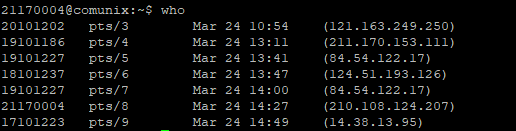

## Chapter 1
<hr/>

```bash
uname -a
```
Operating System information  
Output: 
`SunOS communix 5.11 11.3 i386 i86pc`
<hr/>


```bash
date
```
Shows the current date  
Output: 
`Wednesday, March 24, 2021 02:30:47 PM KST`
<hr/>

```bash
id
```
Shows User ID and Group ID
Output: 
`uid=1563(21170004) gid=500(studs)`
<hr/>

```bash
who
```
Shows who is connected on which terminal
Output: 

<hr/>

```bash
uname -a
```
Output: 
`SunOS communix 5.11 11.3 i386 i86pc`
<hr/>

```bash
uname -a
```
Output: 
`SunOS communix 5.11 11.3 i386 i86pc`