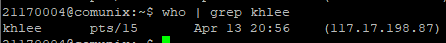

## Chapter 1 - Unix Basic
<hr/>

### Telnet setup

Telnet is a protocol that is needed to connect to a Unix Server (or SSH). It provides an iteractive text-oriented communication using a terminal.

```bash
$ ipconfig # shows IP configuration of current machine

$ ping 10.10.54.75 # Sends ICMP Packages to destination and checks if the server is reachable

$ telnet 10.10.54.75 # Starts a Telnet Connection
```

### Login
The Server prompts the username and password. If entered successfully the user will be able to use the Unix-Server. Output:  


```bash
$ exit # Exits the (telnet) session
```

### Unix Command Syntax

Unix Command Syntax works as follows: 

```bash
$ command [option] [arguments]
$ ls -sCF /usr/bin # Example
```

### SSH

SSH works similar to connecting to a server with Telnet but the messages are encrypted.

```bash
$ ssh 10.10.54.75
```   
Putty is a program that allows to connect via SSH or Telnet:  


### Basic Commands
```bash
uname -a
```
Operating System information  
Output: 
`SunOS communix 5.11 11.3 i386 i86pc`
<hr/>


```bash
date
```
Shows the current date  
Output: 
`Wednesday, March 24, 2021 02:30:47 PM KST`
<hr/>

```bash
id
```
Shows User ID and Group ID
Output: 
`uid=1563(21170004) gid=500(studs)`
<hr/>


```bash
groups
```
Output: 
`stud` //current group
<hr/>

```bash
who
```
Shows who is connected on which terminal  
Output:   


```bash
who | grep khlee
```

Output:  


<hr/>

```bash
finger [id]
```
Output:   

<hr/>
<hr/>

```bash
w
```
Output:  

<hr/>

### Terminal Setting

```bash
$ tty #shows current terminal
$ stty -a #shows more terminal settings
$ stty erase #Rebinds/Deletes terminal setting
$ echo hello | write unix300 pts/7 # Writes a message to user unix300 on terminal pts/7
```

### Password Change

```bash
$ passwd # prompts to enter old and new password
```