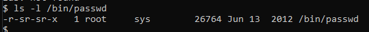

## Chapter 10 - Job Control & Process Management

<small>Philipp Moritzer - 21170004</small>
<hr/>

### Process

- Instance of a running program
- PID: Each process has a process identifier (1- 32768)
- PPID: Parent PID
- pid 0: schedule daemon
- pid 1: init process

```bash
$ ps [-l] # see own processes
$ ps -ef # see all processes
$ echo $$ # see current shell pid
```

### Shell Scripts

- \# : comments
- #! : sh-bang
  - Tell the kernel to run the program listed after the #!
- my.sh
  - #!/bin/cat
  - Hello World
  - ^d
- chmod u+x my.sh
- ./my.sh

### Stopping Process

- Ctrl + C (^C)
  - Stops current process
- kill commands (send SIGNAL to process)
  
```bash
$ kill -l # list signal names
$ kill -9 pid # terminates process pid
$ pkill program_name # terminates process by name
$ pkill sleep #
```

### /proc file system

- Contains a directory for active process named after PID
```bash
$ ls -l /proc/$$ # current process
$ ls -l /proc/1 # process pid 1
```

### SETUID
- When a regular user runs a prorgram that has a SETUID bit, the effective UID is change to the UID of the program owner
- /usr/bin/passwd 
  - If the file is part of the process started by a user, the process is able to progress with the permission of the file's owner
- /usr/bin/crontab
```bash
$ find / -perm -4000 # Find Special permission file using SETUID
$ chmod u+s myprog # Set special permission for myprog file for the user
```

### SETGID
- When a regular user runs a program that has a SETUID bit, the effective GID is changed to the GID of the program owner

```bash
$ find / -perm -2000 # finds file with SETGID bit set
$ chmod g+s myprog # adds setgid for file myprg
```

Example:

/bin/passwd  

   

 The file has SETUID set and with the permission of root the user is able to change its password. The root permission allows to write the password into the /etc/shadow file, which the user does not have access to.  


### Job Control
- Two types of process:
  - Foreground: Terminal occupied
  - Background: Release the terminal
- & ampersand
  - Start as background

```bash
$ sleep 60 & # starts sleep 60 seconds in background and does not occupy the terminal
$ jobs # shows background process
$ ps # shows foreground and background process
```

### Job commands
```bash
$ jobs # list jobs
$ fg [%n] # change process to foreground
$ bg [%n] # change process to background
$ kill %n # kill process
$ kill -18 %n # stop process
$ kill -19 %n # resume process
$ kill -9 pid # kill process
```