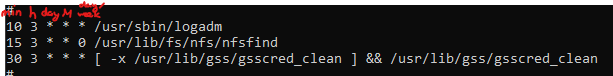

## Chapter 11 - Running program at specified times

<small>Philipp Moritzer - 21170004</small>
<hr/>

### System clock

```bash
$ date # shows current date/time
$ date 201505050001.30 # changes time to 2015/05/5 
```

### Scheduling commands

- Cron
  - Periodic
  - Crond (daemon), crontab (file)
  - ```bash 
    $ crontab filename 
    $ crontab -e # edit
    $ crontab -l # list
    $ crontab -r # remove
    ```
- At
  - One time
  - Atd
  - ```bash
    $ at -t filename # set job
    ```

### crontab

```bash
$ EDITOR=vi
$ export Editor
$ crontab -e
    - minute: 0-59
    - hour: 0-23
    - day of month: 1-31
    - month: 1-12
    - day of week: 0-7
    - command
```  

  

### Crontab expression
- Comma and no space
  - 0,2,5,7,9
- Through
  - 1-5
- Every
  - \*
- Step
  - 10-16/2
  - 10,12,14,16

### Managing out from cron

```bash
$ [commands] | mail -s "..." username
    # -s: subject
    # username
$ [command] >> log.file # redirect output to log file
```

### Controlling access to cron/at
- /etc/cron.allow
  - specify allowed username for cron
- /etc/cron.deny
  - deny user from using cron
- /etc/at.allow
  - specify allowed username for at
- /etc/at.deny
  - deny user from using at
- username
  - ALL - all users can use at/cron

### at
- One time execution
```bash
  $ atq # shows waiting list
  $ atrm # remove job from waitingl ist
  $ at 17:00 # sets one time job for 17:00
  $ at 4pm + 3 days # schedule one time job 3 days later
  $ at -f at.file # using file to schedule command
   ```  