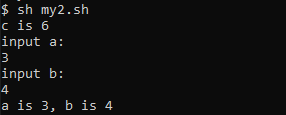
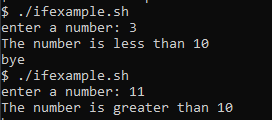

## Chapter 13 - Basic Shell Scripting


<small>Philipp Moritzer - 21170004</small>
<hr/>

### Script Language

- Script is a program that runs on the interpreter

- Unix shell is an interpreter (as well as DOS-Shell)

- Shell reads the script and runs it line-by-line

- Languages like C/C++ must be compiled before running

### Usage

- Shell Scripts are used for System Administration

- Automate a vast range of jobs with a few simple scripts
  - Save time by automating repetitive jobs

### Script file

Script file (text file) using vi
```sh
#!/bin/sh 

# executed by /bin/sh
# Shebang: hash(#), bang(!)

a=1 # variable = value
a=`expr $a+1` # back quote for expressions

read var #read from keyboard and save to variable var
```

### Example

```sh
#!/bin/sh

a=1
b=3
c=`expr $a + $b + 2`
echo "c is $c"
echo "input a:"
read a
echo "input b:"
read b
echo "a is $a, b is $b"
```  
Output:  
  

### Special Variables

- ? : previous command's exit status
- $ : PID of the current shell
- \- : Options at the start-up
- ! : PID of the last background process
- 0 : script name
- 1-9 : command-line arguments 1-9
- \- : last argument

### Flow Control

- Test command
   ```bash
  - $ test expression
  - $ [expression]
  ```
- Operator: =, <, > !=
- Conditional FLow Control
  - If-then-fi, if-then-else-fi, case-in-esac
- Iterative Flow Control
  - While-do-done, until-do-done

### If condition example

```bash
/usr/ucb/echo -n 'enter a number: ' read num
if test $num -gt 10
then
 echo The number is greater than 10
else
 echo The number is less than 10
fi
echo bye
```  

Output:  
  