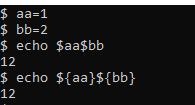
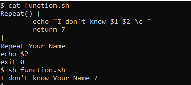
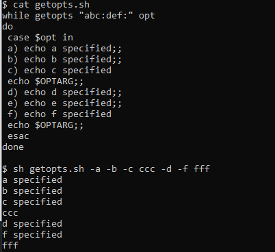

## Chapter 14 - Advanced Shell Scripting


<small>Philipp Moritzer - 21170004</small>
<hr/>


### Input/output redirection

- Three standard files
  - STDIN (0): keyboard
  - STDOUT (1): monitor
  - STDERR (2): monitor

- Redirection Operator
  - \> : redirect STDOUT to a file
  - \>> : appends STDOUT to a file
  - \< : redirect STDIN to a file
  - \|:  sends output of a process to input of other process
  - \<< : Associate input stream until delimiter 

```bash
$ cat << AAA
The Cat
Sat on the
Mat .
AAA # end string
```


```bash
$ find / -name "*.txt" > out.txt 2> err.txt # error output to err.txt, nomral output to out.txt
```

### Command Substitution

- Substutites Results
- Back tick
- ```bash
  $ Lines=`wc -l textFile`
  $ a=`expr $a +1`
  ```
- Brace expansion
 ```bash
 $ Lines="$(wc -l textFile)" # does not work at sh
 ```  
  

### Shell variable

```bash
$ a=5 # sets a variable to 5
$ export a # makes a a env variable
$ export b=7 # define new env variable
$ echo $a # prints a result (5)
$ set # shows all shell variables
$ env # shows all environment variables
$ set | grep PATH # show location of PATH variable
```

### Shell functions
- Function Syntax: name() {commands; }

```bash
Repeat() {
    echo -n "I don't know $1 $2"
    return 7
}
Repeat Your Name
echo $?
exit 0
```  

  

### Scope

- There are two types of scope
  - local & global

```bash
scope() {
    local lov=1 # local variable
    glov=2 # global variable
    echo local $lov global $glov
}
scope
echo local $lov global $glov 
```

Output:  
´local 1 global 2´  
´local global 2´ 

### Function Libraries

- Include function script file using dot(.)

```bash
. ./scope.sh # read from scope.sh
scope # function call
```

### getopts
- A built-in command line parser

```bash
while getopts "abc:def" opt
do
    case $opt in
        a) echo a specified::
        b) echo b specified::
        c) echo c specified
            echo $OPTARG;;
        d) echo d specified::
        e) echo e specified::
        f) echo f specified
            echo $ OPTARG::
    esac
Done
```
```bash
$ sh getopts.sh -a -b -c cc -d -e -f ff
```

Output:  

  

### Signals and Traps

```bash
$ trap '' 2 # single quote, ignore ^c
```
```bash
trap '' 2 
while [ 1 = 1 ]
do
read a
if [ $a = 'a' ]
then
    exit
else
    echo you pressed $a
fi
done
```  
Output:  

    

### File Handling

```bash
$ If [ -w writeFIle || -x writeFile ] # if file has writeable or executable permission statement will result in true

$ If [ -r writeFile && -s writeFile ] # true if file is readable and size is greater than 0
```
Arguments:
  - -d: directory
  - -e: file exists
  - -r: readable
  - -w: writeable
  - -x: executable
  - -s: size is greater than zero

