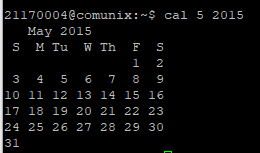
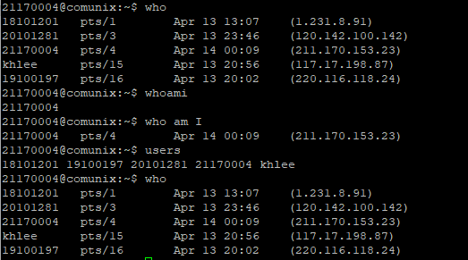
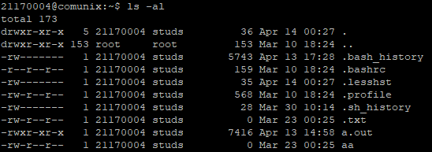
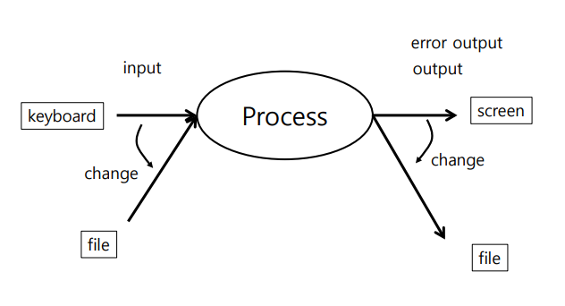
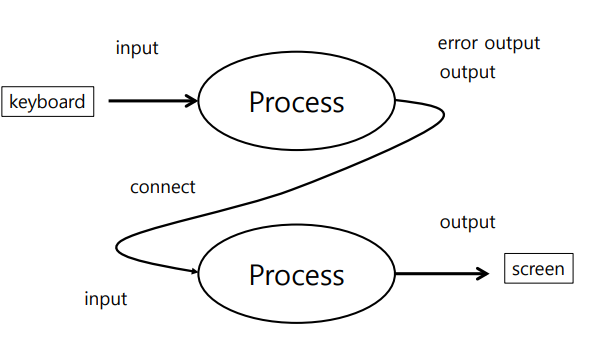
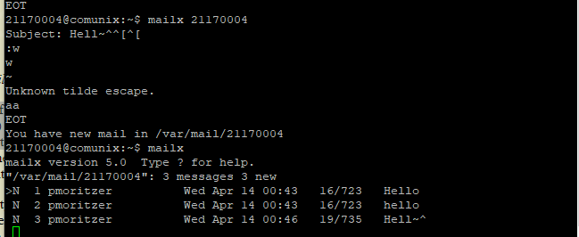

## Chapter 2 - Unix Tutorial
<small>Philipp Moritzer - 21170004</small>
<hr/>

### Cal
Displays a calendar on the terminal

```bash
$ cal # shows the calendar of current month
$ cal 2015 # shows the calendar for all months of 2015
$ cal 5 2015 # shows the calendar for May 2015
```
Output:  


<hr/>

```bash
$ whoami # displays user name
$ who am I #shows username, terminal number, login time, ip address
$ users # lists usernames of logged in users
$ who #displays who is logged in
```

Output:  


### ls

Lists all files or folders of directories

```bash
$ ls
$ ls -sCF #size multi-column indicates if it's file or folder
$ ls -s -C -F /usr/bin # same as above for another directory
$ ls -a # lists all files (hidden files as well)
$ ls . # current directory
$ ls -al # shows a list with permissions and other infos
$ ls -ld # lists directories only
```
Example Output: 
 

### I/O Redirection

A process is a running program that consists of an input, an output and an error output. With I/O Redirection it is possible to change the input and output of a program.  



```bash
$ 1> #change output
$ 2> #change error output
$ < #change input
$ echo hello > hi.txt # example
$ cat filedoesntexist.txt 2> error.txt # example2
```

### Pipe

With a pipe it is possible to connect the output or the error output to another process:  



### echo

```bash
$ echo hi~ #prints hi~ on the console
$ echo hi > hi.txt #writes 'hi' into the file hi.txt
$ echo hello >> hi.txt #appends hello to the file hi.txt
$ echo hello | write unix300 # shows hello on the terminal of user unix300
$ echo hello | write unix300 pts/7 # same as above but specifying  the terminal
$ echo $PATH #prints the PATH-Variable
$ banner Hi~ # prints a big Hi~ on the terminal using ASCI-Characters
```

### wc

Word-Count command.

```bash
$ cat hi.txt # shows content of hi.txt
$ cat /etc/passwd | wc # shows size, rows and word count of file hi.txt
$ wc /etc/passwd # Same as above without using a pipe
$ wc -l /etc/passwd # displays amount of lines
```

### cp, mv, rm

Copy, Move, Remove

```bash
$ cp hi.txt hi2.txt # Copies file hi.txt with its contents to file hi2.txt
$ rm hi2.txt # removes FIle hi2.txt
$ mv hi.txt hi3.txt # Moves contents from file hi.txt to new file hi3.txt and deletes file hi.txt
```

### directory

Important Directory commands

```bash
$ pwd # prints current working directory
$ cd .. # change working directory to upper folder
$ cd / # change working directory to specified path
$ mkdir dir1 # creates new directory with name dir1
$ rmdir dir1 # removes dir1
```

### mail

```bash
$ mailx # Prompts mail Program, if no mails just a message, otherwise the user will be asked for a mail
$ mailx unix300 #sends mail to user unix300
$ mailx unix300 < hi.txt # sends mail with content of file hi.txt
$ ls /var/mail # folder containing mails for users
```

Output:  



### grep

Grep stand for global regular expression and is used for filtering Files or Text by using regular expressions.

```bash
$ cat /etc/passwd | grep unix30 # only shows lines of files that include 'unix30'
$ grep unix30 /etc/passwd # same as above in /etc/passwd file without piping
$ ls -l | grep hi # lists all files that contain hi in their name

```

### Viewing Text Files

```bash
$ cat /etc/passwd # Shows content of /etc/passwd file
$ cat /etc/passwd | more # Only shows a few lines and the file is scrollable by using the space bar
$ more /etc/passwd # same as above without piping
$ less /etc/passwd # similar to more but allows forward and backward navigation
$ pg /etc/group # Pagination for passwd file (allows the user to enter a page)
$ head -5 /etc/group # shows the first 5 lines of the file
$ tail /etc/group #prints the last lines of the file
```

### Redirection

```bash
$ echo hi > hi.txt # saves the output 'hi' of echo into hi.txt file
$ mailx unix300 < hi.txt # sends mail to user unix300 with the contents of hi.txt
$ mkdir1
+ $mkdir dir1 2> err.txt # Prints error of folder already existing to err.txt
$ find /export/home -name 'hi.xt' 2> err.txt 1>out.txt # prints the error (permission denied e.g.) to err.txt and the finding results for 'hi.txt' into out.txt
```