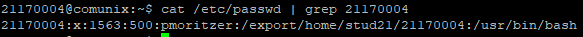
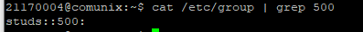

## Chapter 3 - Users and Groups
<small>Philipp Moritzer - 21170004</small>
<hr/>

### Accounts

There are three primary types of Accounts:

- Root Accounts
  - Super User
  - Complete and unrestricted control of the system
  - No restrictions
- System Accounts
  - Needed for the operation of system-specific components
  - Mail, bin, adm, daemon, ...
- User Accounts
  - Limited Access

### /etc/passwd
The /etc/passwd-File identifies the authorized accounts for the system.  



- 21170004 username
- x - not used
- 1563 - User ID
- 500 - Group ID
- pmoritzer - comments
- /export/home/stud21/21170004 - Home Directory
- /usr/bin/bash - Login shell


### /etc/group



Last Field: members
Primary group information is stored in /etc/passwd file

### /etc/shadow

The /etc/shadow file stores actual password in encrypted format and other passwords related information such as user name, last password change date, password expiration values, etc,.

```bash
$ cat /etc/shadow # only available as super user
```

Output:  `root:62rmkjdR3h5Pk:11944::::::`
`unix306:uAJSB7ZC0suPM:16503::::::`
`nobody:NP:6445::::::`
`listen:*LK*:::::::`
etc.

NP - no password is valid
LK - Account is locked until the Super-User sets a password

```bash
$ login-id:password:lastchg:min:max:warn:inactive:expire:flag
```

- login-id: Login name
- Password: 13 character encrypted password
- Lastchg: Number of days from Jan 1, 1970 to last password change
- Min: Minium number of days between password changes
- Max: Max Number of Days where the password is valid
- warn: Number of days until the user gets a warning that his password needs to be changed
- Inactive: Number of days the user is allowed to be inactive
- expire: After that date the login cannot longer be used
- flag: not used
  
### su

Substitute User (or Switch User)

```bash
$ su [-] id # switches the current user to given id
$ su unix345 # example
$ su - unix345 # changed to unix345 environment, can be checked with pwd command
$ su # switching to root user
```