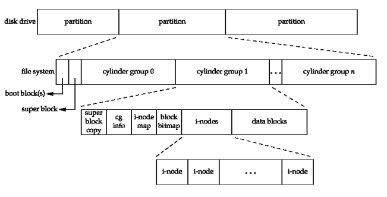
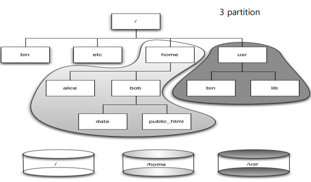
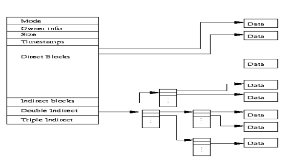
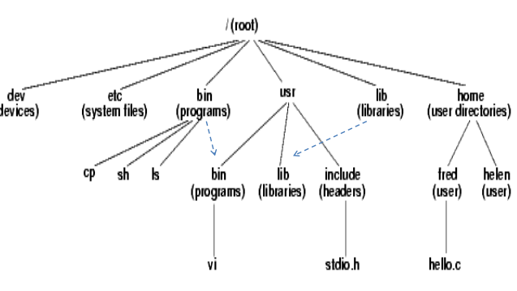

## Chapter 4 - File System
<small>Philipp Moritzer - 21170004</small>
<hr/>

### File System Architecture

File System:  

  


Unix File Sytstem:  



i-node and data block:  

  

Unix directory tree:  

  

- / : root directory of entire file system
- /devices : physical device files
- /dev : logical device files
- /etc : system-wide configuration files
- /mnt : temporarily external mounted filesystems
- /opt : Optional application software packages
- /proc : Kernel and Process information as files
- tmp : temporary files which will be deleted between system reboots
- /bin : command binaries (/usr/bin also contains these)
- /sbin : System binaries that are not essential, for example for daemons and network services
- /lib : Libaries that are used by the binaries in /usr/bin and /usr/sbin
- /usr : working directories for mulitple purposes
- /var : Variable files that constantly change (logs, mails, etc)
- /home : Home and working directories of users
- /export : remote file systems

### Navigating the file system

```bash
$ echo hi > hi.txt # Creates new file hi.txt with content 'hi'
$ ls # lists files in a directory
$ cat hi.txt # shows content of file hi.txt
$ more /etc/passwd # shows content of /etc/passwd with being able to navigate forwards through lines using the spacebar
$ less /etc/group # same as more but being able to move forwards and backwards
$ head -5 /etc/hosts # shows the first 5 entries of the /etc/hosts file
$ tail -f /var/log/syslog # shows last lines of the file
$ pg /etc/profile # makes content navigateable by using page numbers
$ cd /usr/bin # changes current working directory to /usr/bin
$ pwd # shows current working directory
```

### Create file
```bash
$ cp hi.txt hi2.txt # copes file hi.txt and its contents to file hi2.txt
$ mv hi2.txt hi3.txt # removes the file hi2.txt and creates new file hi3.txt and moves its contents to hi3.txt
$ rm hi3.txt # removes file hi3.txt
$ touch a.txt # creates new file with name a.txt. If it exists already, it changes the last edited time of the file
$ mkdir dir1 # creates directory called dir1
$ mv dir1 dir2 # renames dir1 to dir2
$ rmdir dir2 #removes dir2 directory
$ whereis echo # shows the path of the echo executable command
$ which echo # same as above
$ cat > aa.txt # Sends input to aa.txt file, save with ctrl + d
$ head -5 /etc/passwd > pass.txt # copies the first few lines of /etc/passwd file to pass.txt file
```

### ls -l

```bash
$ ls -l
```
Output:  
i-node  


`File type: permission: link number: owner: group: last editing time: file name`


### File types

The first character of `ls -l` command indicates the file type as follows:
 
- d : directory
- b : block special file
- c : character special file
- l : symbolic link
- p : First-in, first-out file
- s : local socket
- \- : ordinary file

```bash 
$ file hi.txt # displays file tpye, for exapmle ASCII text
```

### Permission

rw-r--r--
User/owner(rw-), group(r--), other(r--)

r = read, w = write, x = execture

- File is readable: cat
- File writeable: can edit
- File executable: Can run the program
- Directory readable: ls possible
- Directory writable: create/delete possible
- Directory executable: cd possible

### Link number

A link is a connection between a file name and a file. It can either be a hard link or a soft link.

```bash
ln hi.txt hi2.txt # creates a new file and increases link number
ln -s hi.txt hi3.txt # create symbolic link
```

### Differences between cp, hard link and soft link

cp: A new i-node is created
ln: The copy of the files references to the same i-node
ln -s: separate i-nodes are created

### Contents / Information

```bash
od -x hi.txt ### shows file contents in hexadecimal, with -c option in ASCII
```
Output:  


### Find 

```bash
$ find /export/home -name 'hi.txt'
2> /dev/null
```
1. Finds all hi.txt files in directory
2. ```2> /dev/null ```omits error output o for access denied

```bash
$ find / -name core -exec rm {} \; #Removes files (- exec ls lists all found, etc)
#-ok statt -exec: Asks if the file should be taken
```

### chmod

```bash
$ chmod 644 hi.txt
$ chmod u+x,g=rw-,o-r hi.txt #+adds permission
#-takes away permission
```
Examples (numeric, octal):  
644: u=rw, g=r--,o=r--  
755: u=rwx,g=r-x,o=r-x  


### umask

```bash
$ umask 022 # Defines masking for permissions
```

### File System Management
```bash
$ df -k # Shows disk free size (partition)
$ du -sk * # Shows disk usage size (directory)
$ mount
$ mound -t device_name mount_point # Shows mounted partitions + status
# with options: mounts new partition
$ mountall # Mounts all file systems defined in /etc/vfstab
$ unmount <device> # Unmounts device
$ unmountall # Unmount all devices
```

