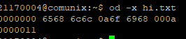

## Chapter 4

```bash
ls -l
ls -ld
```
Output: 
1. data blocks - Wenn auf Directory angwendet das leer ist, kein output
2. i-node  

<hr/>

```bash
od -x hi.txt
```
Output:  


File Contents in hexadecimal  
-c: in asci
<hr/>  

```bash
find /export/home -name 'hi.txt'
2> /dev/null
```
1. Finds all hi.txt files in directory
2. ```2> /dev/null ```omits error output o for access denied

```bash
find / -name core -exec rm {} \;
```

Removes files (- exec ls lists all found, etc)

-ok statt -exec: Fragt, ob das file genommen werden soll

<hr/>

```bash
chmod 644 hi.txt
chmod u+x,g=rw-,o-r hi.txt
```
644: u=rw, g=r--,o=r--
755: u=rwx,g=r-x,o=r-x  

+fügt berechtigung hinzu
-nimmt Berechtigung weg

<hr/>

```bash
umask 022
```

Defines masking for permissions

<hr/>

```bash
df -k
```
Shows disk free size (partition)

```bash
du -sk *
```
Shows disk usage size (directory)

```bash
mount

-t device_name mount_point
```
Shows mounted partitions + status
with options: mounts new partition

```bash
mountall
```
Mounts all file systems defined in /etc/vfstab

```bash
unmount <device>

unmountall
```
Unmounts device

<hr/>