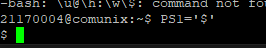

## Chapter 5 Customizing Working Environment

### System Variables

```bash
$PS1 - Shell apperance
$PS1 = '$ '
```
Output:



```bash
$PATH - executables
```

### Local/environment Variable

Local variable: affects current shell only

Environment variable: affects sub-shell as well
```bash
$ a = 3 //local variable
$ export a // exposes variable
```

Example:
```bash
$ a=3; b=5
$ echo $a $b // 3, 5
$ export b
$ sh // start sub-shell
$ echo $a //no result
$ echo $b //5
$ exit //return to parent shell
```

### Variable Commands

```
$ set //see all variables and its values
$ set | grep PATH
$ env //lists exported variables
$ echo $variable
$ export //makes variable an env variable
$ unset // delete variable
```

### Alias

```bash
$ Substituting one term to another
$ alias ls='ls -l'
$ unalias ls
```
