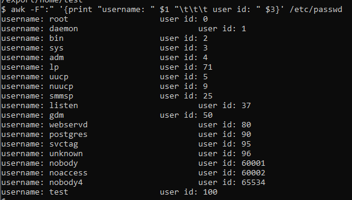
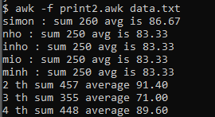

## Chapter 9 - AWK
<small>Philipp Moritzer - 21170004</small>
<hr/>

### awk

- An output formatting language
- Performs operations primarly on exisitng text
- Pattern-Matching program
- Takes 2 inputs
  - Command
  - Data  
```bash 
$ awk '{print $0}' /etc/passwd
```
- Output is sent to standard output

### Extracting data

```bash
$ awk -F":" '{print "username: " $1 "\t\t\t user id: " $3}' /etc/passwd
```  
Output:  
  

```bash
-F # switch : field seprator, default is blank space
- $1 # first field
- $3 # third field
- $0 # whole line
```

### Command 2 parts

- Patterns
  - Patterns are matched with the line of the data file
  - No pattern provided: Any line is always executed
- Actions
  - Have several constructions
  - Each instructions include =, if, while, for, print, printf

### Patterns
- Consists of
  - String of text
    - Example: /unix/
  -  Regular Expression
     -  Example: [a-z]

- Escape sequence at Printf
  - \n (new line), \' (single quotation mark), \\\ backslash, \0 null, \b backspace


### Standard Variables
-  FS: field separator
-  NR: current line
-  NF: number of words on a specific line
-  FILENAME: name of input file
-  RS: separator for each line in a file


### Programming with awk

```bash
$ awk -f print.awk /etc/passwd
```
- Awk file:

```bash
- BEGIN {FS=":"; total=0}
- {total+=1; print $1 $3}
- END {print total NR}
```

- Awk needs three sections:
  - BEGIN: executed only at the beginning
  - Main: executres once for each and every line
  - BEGIN and END can be omitted


### Example.awk

```awk
BEGIN { num = 0; a[2] =0 ; a[3] = 0 }
{ sum=0
 for ( i=2 ; i<=NF ; i++ ) {
 sum += $i; a[i] += $i
}
 printf("%s : sum %d avg is %.2f \n", $1, sum, sum/(NF-1))
num++
}
END {
for ( i=2 ; i<=4 ; i++ ) {
 printf "%d th sum %d average %.2f \n", i, a[i], a[i]/NR
 }
}
```  

Output:  

